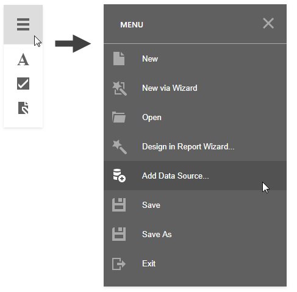
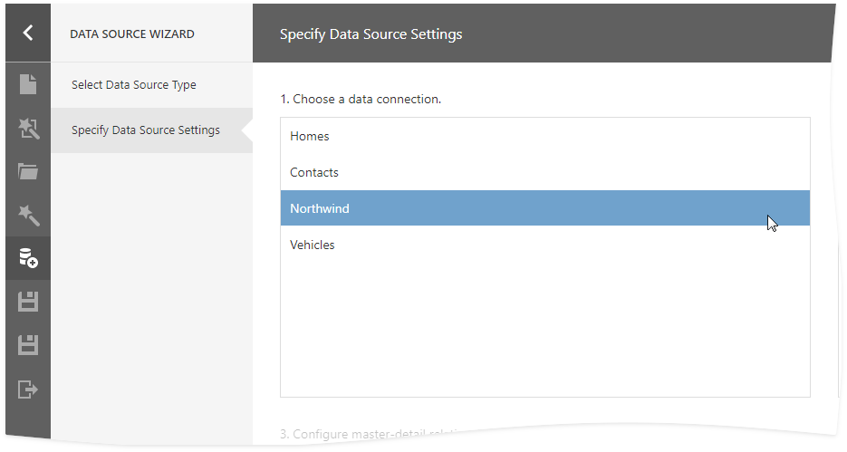
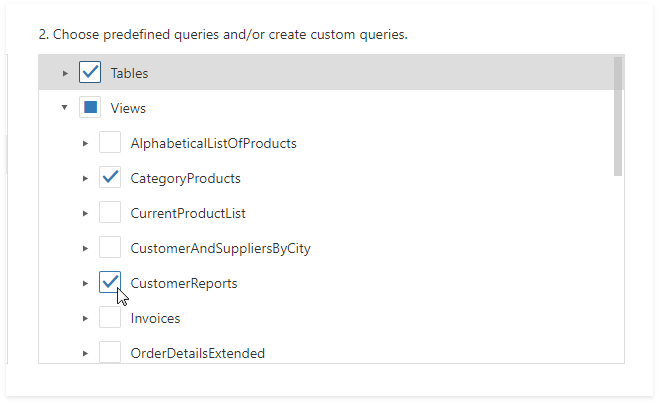
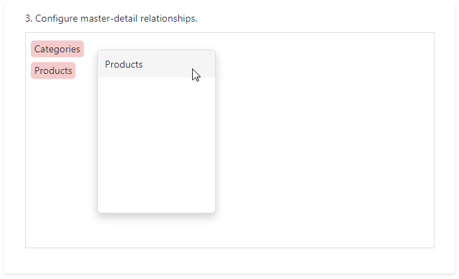
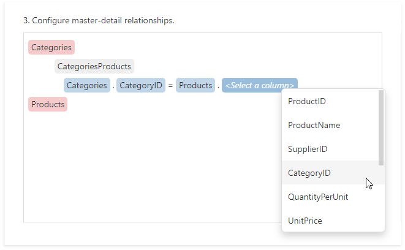

# Bind a Report to a Database

This tutorial illustrates how to bind a report to a database and specify a master-detail relationship between data source queries.

## Add a New Data Source

1. [Create a new blank report](../../report-designer/add-new-reports.md).
2. Invoke the designer [menu](../report-designer-tools/menu.md) and click **Add Data Source...**.

    

   The menu contains this command if your software vendor provides data connections.

3. Select the data connection on the [Data Source Wizard](../report-designer-tools/data-source-wizard.md)'s first page and click **Next**.

    

4. Choose which tables, views and/or stored procedures to add to a report and click **Next**. Select two or more tables to [create a master-detail report](../create-popular-reports/create-a-master-detail-report-use-detail-report-bands.md).

    
    
    > [!NOTE]
    > You can also create [custom queries](../report-designer-tools/data-source-wizard\specify-data-source-settings-database.md) to shape data at the data source level. Select **Queries** and click the plus button to add a new query.
    > 
    > The invoked [Query Builder](../report-designer-tools/query-builder.md) allows you to join multiple tables, filter, sort, and group their data, and calculate various aggregate functions.
      

5. Set master-detail relationships on this wizard page. Hover the master table name, click the plus button and choose the detail table. 

    

    Select the required key fields (columns) to connect tables. 

    

    Click **Finish** to close the Data Source Wizard.

## Use an Existing Data Source

You can bind your report to a predefined data source. Open the [Field List](../report-designer-tools/ui-panels/field-list.md) panel, click the **Add New DataSource** button and select a data source from the drop-down list.

The Field List reflects the added SQL data source and its hierarchy. You can select the data source to edit it.

